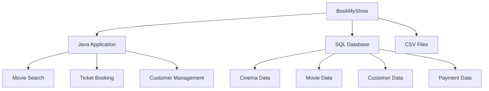

# BookMyShow Project

## Overview

The **BookMyShow** is a comprehensive Java-based application developed as part of my semester 2 project. The application is designed to streamline cinema bookings by allowing users to search for movies, view cinema details, and book tickets effortlessly. Utilizing both SQL databases and CSV files, the project effectively manages data related to cinemas, movies, customers, and payments. This project showcases my skills in Java programming and database management while addressing real-world booking system challenges.


## Features

- **Search Movies**: Easily search for movies by title, description, or cinema.
- **Cinema Management**: View and manage comprehensive cinema details.
- **Ticket Booking**: Effortlessly book tickets for movies and manage bookings.
- **Customer Management**: Manage customer profiles and login information.
- **Payment Processing**: Handle secure payments for booked tickets.

## Project Structure

Here's an overview of the project's main components:



## File Structure

The project consists of several key files organized as follows:

| File Type      | File Name               | Description                                                                 |
| -------------- | ----------------------- | --------------------------------------------------------------------------- |
| **Java Files** | `BookMyShow.java`       | Main application file for managing the overall functionality of the system. |
|                | `MovieSearchMenu.java`  | Handles searching and displaying movie information.                         |
|                | `TicketBooking1.java`   | Manages the ticket booking process, including seat selection and payment.   |
| **CSV Files**  | `cinema_details.csv`    | Contains information about cinemas, including cinema ID, city, name, and address. |
|                | `CINEMASEATS.CSV`       | Stores seat availability data for each cinema screen.                       |
|                | `CUSTOMER.CSV`          | Maintains customer details such as ID, name, email, and login information.  |
|                | `movies_details.csv`    | Holds information about movies, including titles, descriptions, showtimes, and ratings. |
|                | `PAYMENT.CSV`           | Contains payment records, including payment ID, customer ID, ticket booked, and amount. |
| **SQL Files**  | `Book_My_Show_Main.SQL` | Main SQL file containing data used by the Java application.                 |
|                | `Book_My_Show.SQL`      | Additional SQL file with data for potential future functionalities.         |

## Installation

To set up the project on your local machine, follow these steps:

1. **Clone the repository**:

   ```bash
   git clone https://github.com/Khushal-Savalakha/JAVA-Projects.git
   ```

2. **Set up the database**:

   - Import `Book_My_Show_Main.SQL` into your SQL database.
   - Ensure the database is connected to the Java application.

3. **Prepare the environment**:

   - Ensure you have JDK installed on your machine.
   - Use a Java IDE like Eclipse or IntelliJ IDEA to open and run the project.

4. **Configure CSV files**:

   - Place the CSV files in the `resources` directory or update file paths in the Java application as needed.

## Usage

Once the setup is complete, you can run and interact with the application:

1. **Run the Application**:

   - Launch the Java application from your IDE or command line.

2. **Navigate the Menu**:

   - Use the menu options to search for movies, view cinema details, and book tickets.

3. **Manage Data**:

   - Use CSV files to update cinema, movie, and customer data as required.

## Future Enhancements

- **Expand functionalities using Book_My_Show.SQL**.
- **Implement additional payment gateways**.
- **Enhance the user interface for a better user experience**.

## Contributing

Contributions are welcome! Please fork the repository and create a pull request with your changes. Ensure your code follows the project's coding standards.

## License

This project is licensed under the MIT License.

## Contact

For questions, suggestions, or support regarding the BookMyShow project, feel free to reach out to me at [khushal.sav@gmail.com](mailto:khushal.sav@gmail.com).
```

This version integrates the updated description and contact information seamlessly. Let me know if you need any more changes!