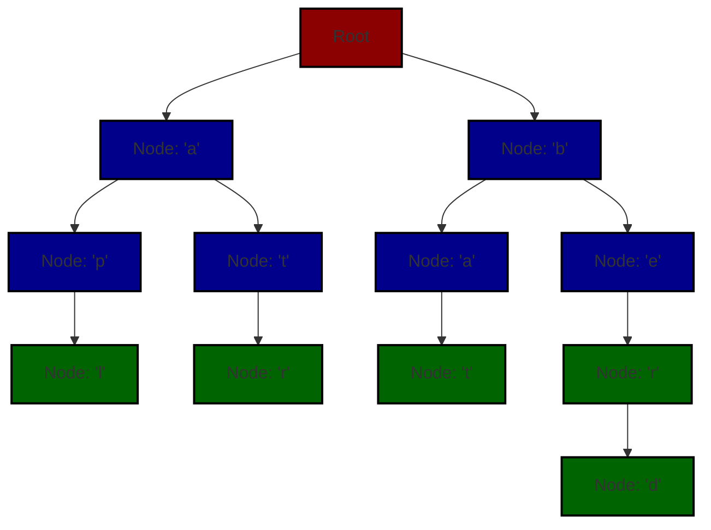
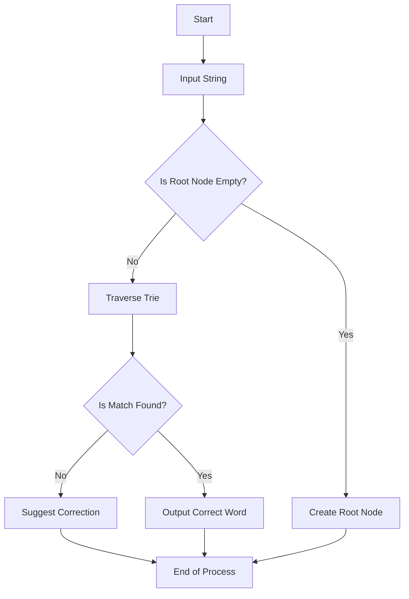


## Spelling Checker

### Project Description

Developed during the second semester of my Data Structures course, this **Spelling Checker** application leverages the **Trie** data structure to efficiently manage and search through a comprehensive dictionary of words. The tool allows users to input sentences, detects spelling errors, and provides suggestions for correct spellings.

### Key Features

- **Efficient Spell Checking**: Utilizes the Trie data structure for quick lookup and retrieval, making it highly effective for large dictionaries.
- **Error Detection**: Identifies and highlights spelling mistakes in user-inputted sentences.
- **Correction Suggestions**: Offers accurate suggestions for misspelled words based on the dictionary.

### Technical Highlights

- **Trie Data Structure**: Implemented to facilitate fast prefix-based searching and insertion, enhancing the performance of spell checking.
- **User Interaction**: Provides an intuitive interface for inputting sentences and receiving feedback on spelling errors.

This project not only demonstrates the practical application of Tries in solving real-world problems but also showcases my ability to apply data structures to create efficient and scalable solutions.

### Folder Structure

The project follows a structured directory format as shown below:

| Folder/File         | Description                                 |
|---------------------|---------------------------------------------|
| `src/`              | Contains the source code for the Spelling Checker |
| `src/Main.java`     | Entry point for the application             |
| `src/Trie.java`     | Implements the Trie data structure          |
| `src/Dictionary.txt`| Contains the dictionary of words            |


### Output
The output of the Spelling Checker is documented in `Output.pdf`.

### Explanation of Trie Data Structure

The **Trie** (prefix tree) data structure is a highly efficient information retrieval data structure used to store a dynamic set of strings, where keys are usually strings.


Here's the updated diagram with medium-dark colors for improved visibility:

### Trie Structure Visualization



### Explanation

1. **Nodes and Edges**:
   - **Root Node**: Highlighted in  *red* .
   - **Intermediate Nodes**: Highlighted in *blue*.
   - **End Nodes**: Highlighted in  *green* .

2. **Visual Elements**:
   - **Root Node** (medium-dark red): Represents the starting point of the Trie.
   - **Intermediate Nodes** (medium-dark blue): Represent characters in words, leading to further nodes.
   - **End Nodes** (medium-dark green): Represent the end of a word in the Trie.

This color scheme should provide a better contrast and make the diagram more readable.
#### Flowchart for Word Search in Trie

The flowchart below illustrates the process of searching for a word in the Trie:



### Performance Metrics

Here’s a quick comparison of the spell-checking performance:

| Operation         | Time Complexity | Description                   |
|-------------------|-----------------|-------------------------------|
| Insertion         | O(L)             | L = Length of the word        |
| Search            | O(L)             | L = Length of the word        |
| Space Complexity  | O(W * L)         | W = Number of words, L = Length of longest word |

### Contributing

Contributions to the project are welcome. If you would like to contribute, please fork the repository and submit a pull request with your changes. Make sure to follow the coding standards and include appropriate tests for new features.

### License

This project is licensed under the MIT License.

## Contact

For questions, suggestions, or support regarding the BookMyShow project, feel free to reach out to me at [khushal.sav@gmail.com](mailto:khushal.sav@gmail.com).
```

This version integrates the updated description and contact information seamlessly. Let me know if you need any more changes!